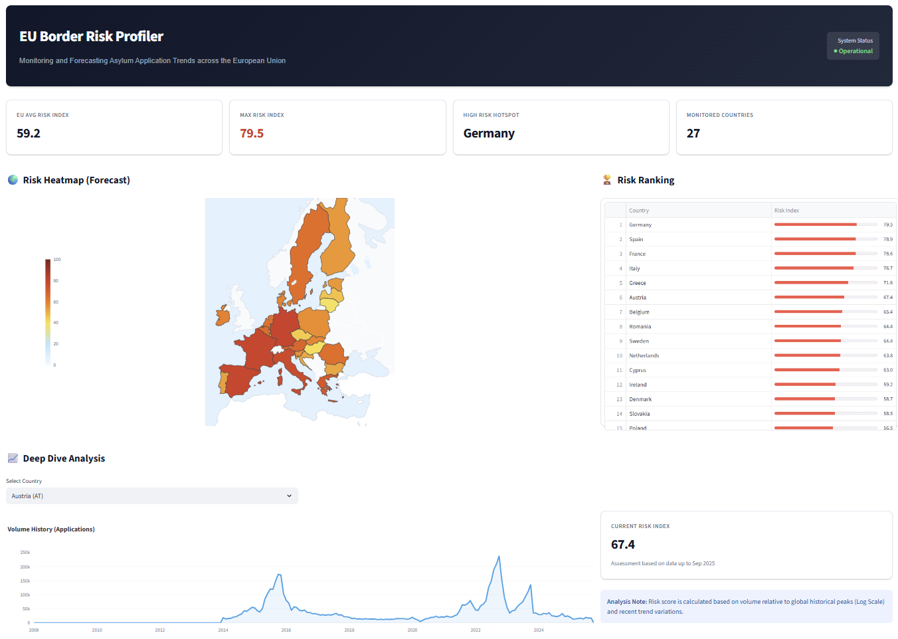

# EU Border Risk Profiler

The **EU Border Risk Profiler** is a specialized intelligence system designed to monitor and forecast asylum application pressure at EU external borders. It leverages historical Eurostat data to calculate real-time "Risk Scores" and predict future trends using machine learning.

🌐 **Live demo** — [risk-profiler.super-h.fr](https://risk-profiler.super-h.fr/)



## Key Features

*   **Advanced Risk Scoring**: Uses a logarithmic global normalization formula to identify high-risk zones without being skewed by historical outliers (e.g., the 2015 crisis).
    *   `Risk = (log(Volume) / log(Global_Max)) * (1 + Trend_Variation)`
*   **Smart Data Handling**: Automatically handles data lags to ensure the heatmap always reflects the *latest valid* intelligence per country, preventing misleading "zero risk" zones due to reporting delays.
*   **Predictive Modeling**: Trains lightweight Random Forest regressors for each of the 27 EU countries to forecast pressure 3 months ahead.
*   **Modern Dashboard**: A "Situation Room" style interface built with Streamlit, featuring dynamic heatmaps, risk rankings, and country-level deep dives.

## System Architecture

The solution adheres to a microservices architecture orchestrated by Docker Compose:

1.  **Data Harvester** (`data_harvester`): 
    *   **Role**: Autonomous agent that queries the Eurostat Bulk API (`migr_asyappctzm`) daily at 02:00.
    *   **Mechanism**: Performs differential updates, parses TSV streams, and handles data cleaning (normalizing gaps).
2.  **Risk Predictor** (`risk_predictor`):
    *   **Role**: Intelligence engine that runs daily at 03:00.
    *   **Logic**: 
        *   Loads sanitized data from PostgreSQL.
        *   Calculates the "Risk Score" (Volume × Trend).
        *   **Auto-Retraining**: Checks for new data and retrains the 27 country-specific models (RandomForestRegressor) on the fly.
        *   Generates forecasts for M+1, M+2, and M+3.
3.  **API Service** (`api_service`): FastAPI backend serving REST endpoints.
4.  **Dashboard** (`dashboard`): Streamlit frontend for visualization.
5.  **PostgreSQL** (`db`): Central persistence layer.

## System Requirements

This project is optimized for efficiency and does **not** require heavy hardware or GPUs. The "lightweight" ML approach (Decision Trees vs Deep Learning) allows it to run on minimal infrastructure.

*   **CPU**: 1 vCPU (2 recommended)
*   **RAM**: 1 GB minimum (2 GB recommended)
*   **GPU**: Not required (Scikit-learn runs on CPU)
*   **Storage**: 5 GB (Docker images + DB volume)

## Quick Start

1.  **Prerequisites**: Docker & Docker Compose.
2.  **Configuration**: Check `.env` (or copy `.env.example`) to set your DB credentials.
3.  **Launch**:
    ```bash
    docker-compose up --build -d
    ```
4.  **Access**:
    *   **Dashboard**: `http://localhost:8501`
    *   **API Docs**: `http://localhost:8000/docs`

## Methodology

### The Risk Formula
The system calculates a "Risk Score" (0-100) for every country/month:
*   **Volume Component**: Normalized logarithmically against the all-time EU high (1.3M applications in 2015). This ensures that a current crisis (e.g., 100k applications) registers as "High Risk" (~85/100) rather than "Low" when compared linearly to the past.
*   **Trend Component**: Adjusts the score based on month-over-month variation (acceleration/deceleration).

### Machine Learning Model
*   **Type**: Random Forest Regressor (Scikit-learn).
*   **Target**: One model per country, trained on 60 months of historical data.
*   **Retraining Strategy**: The system attempts to load an existing model (`model_registry`). If new data is detected during the daily run, it automatically triggers a retraining cycle to keep forecasts accurate.

## Project Structure

```
eu-border-risk-profiler/
├── api_service/      # FastAPI backend + Streamlit dashboard
├── data_harvester/   # Eurostat parser & loader (atomic staging swap)
├── risk_predictor/   # ML training & scoring engine (RandomForest, hold-out eval)
├── db_init/          # PostgreSQL schema bootstrap
├── docs/             # Formal documentation (ADRs, model card, threat model)
├── docker-compose.yml
├── DEPLOYMENT_GUIDE.md
├── DOKPLOY_GUIDE.md
└── OPERATIONS_GUIDE.md
```

## Documentation

Operational guides for running and deploying the system:

- [DEPLOYMENT_GUIDE.md](DEPLOYMENT_GUIDE.md) — Docker Compose deployment.
- [DOKPLOY_GUIDE.md](DOKPLOY_GUIDE.md) — Dokploy-specific notes.
- [OPERATIONS_GUIDE.md](OPERATIONS_GUIDE.md) — runbook.

Formal engineering and governance documentation under [`docs/`](docs/):

- [Architecture Decision Records](docs/adr/README.md) — load-bearing
  technical choices, in Michael Nygard's ADR format.
- [Model Card](docs/MODEL_CARD.md) — predictive component scope,
  evaluation methodology, intended and out-of-scope uses.
- [Data Card](docs/DATA_CARD.md) — source dataset description, lag
  and revision behaviour, what the data is *not*.
- [Security posture](docs/SECURITY.md) — STRIDE threat model and
  controls.

## License

**MIT License**

Copyright (c) 2025

Permission is hereby granted, free of charge, to any person obtaining a copy of this software and associated documentation files (the "Software"), to deal in the Software without restriction, including without limitation the rights to use, copy, modify, merge, publish, distribute, sublicense, and/or sell copies of the Software, and to permit persons to whom the Software is furnished to do so, subject to the following conditions:

The above copyright notice and this permission notice shall be included in all copies or substantial portions of the Software.

THE SOFTWARE IS PROVIDED "AS IS", WITHOUT WARRANTY OF ANY KIND, EXPRESS OR IMPLIED, INCLUDING BUT NOT LIMITED TO THE WARRANTIES OF MERCHANTABILITY, FITNESS FOR A PARTICULAR PURPOSE AND NONINFRINGEMENT. IN NO EVENT SHALL THE AUTHORS OR COPYRIGHT HOLDERS BE LIABLE FOR ANY CLAIM, DAMAGES OR OTHER LIABILITY, WHETHER IN AN ACTION OF CONTRACT, TORT OR OTHERWISE, ARISING FROM, OUT OF OR IN CONNECTION WITH THE SOFTWARE OR THE USE OR OTHER DEALINGS IN THE SOFTWARE.
